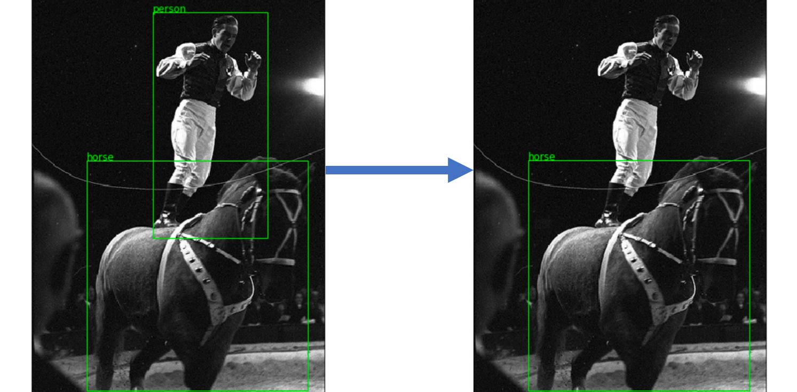
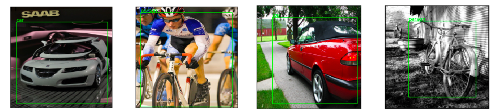
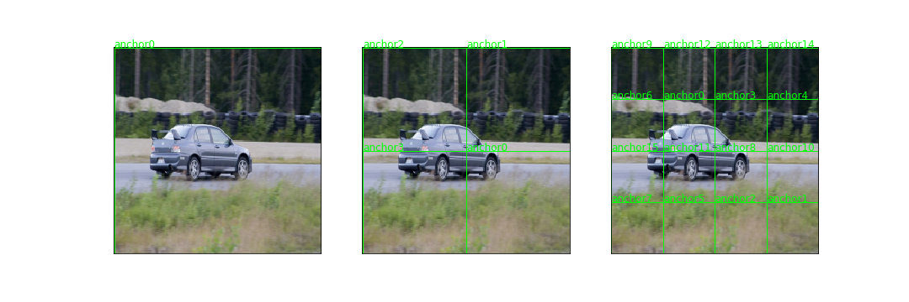
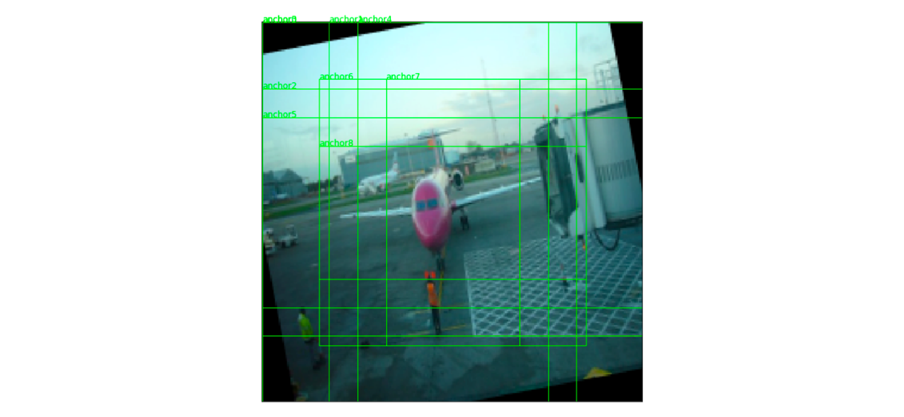
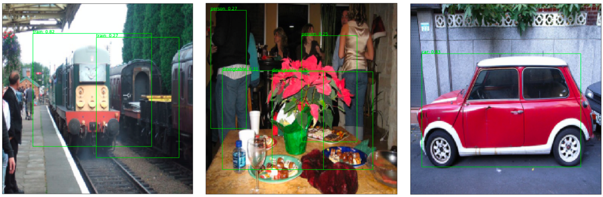

# Object detection

This folder contains code to do the following:

- Read and explore the [Pascal VOC 2007 dataset](http://host.robots.ox.ac.uk/pascal/VOC/voc2007/index.html)
- Train a model to identify and locate the largest object in an image
- Train a model to identify and locate all objects in an image

### 1. Single object detection

#### 1.1. PreProcessing

This is the relatively straightforward problem of finding the bounding box of the largest object in the image. To do this,
the `SingleImageDataset` uses `voc.utils.keep_largest_annotation` to find the largest object in an image (where the size
is determined by the size of the bounding box):

#### 1.2. Model

Resnet 34 (excluding the last two layers) is then finetuned with an interim linear layer, and 24 outputs: 
4 for the bounding box corners `(xmin, ymin, xmax, ymax)` and an output for each of the 20 categories in the VOC 2007 dataset,
yielding `voc.models.SODNet`.

The bounding box outputs and the layer outputs each get an additional linear layer, so that in total, 3 linear layers are
being finetuned. All linear layers are followed by a ReLU activation, batchnorm and dropout.

To constrain the bounding box coordinates to be within the image size, the outputs are then put through a sigmoid activation
(forcing them to be between 0 and 1), and multipled by 224 (since all images input into resnet must be resized to be `224*224`).

#### 1.3 Training

L1 loss is used for the bounding box coordinates, and cross entropy loss is used for the labels. In addition, a cyclical
learning rate with an Adam optimizer.

After training for only 4 epochs, the model gives reasonable results:

### 2. Multi object detection

#### 2.1 Preprocessing
In order to recognize multiple objects in an image, a multi-object detector will have many outputs, each responsible for
locating an object in a particular part of the image.

To define which part of an image a particular set of activations is responsible for finding an object in, the image will
split into anchor boxes.

To compensate for the many different sizes and dimensions of objects in an image, this will happen in two ways:

* The image will be evenly split into overlapping squares (i.e. a set of squares will split the image into 1, 4 and 16).
This happens using `voc.utils.make_anchors`:

* Each of these *base anchors* will then be zoomed and rescaled in a variety of ways. This happens using `voc.utils.permute_anchors`.
Considering only the largest anchor (the leftmost image above), this yields the following:

This ultimately yields 189 anchor boxes, requiring `(189 * 24)` activations.

#### 2.2. Model

The output of the 3rd to last layer of Resnet34 is a `(7, 7, 512)` tensor. By applying 2D convolutions with stride 2, this
can be reduced to `(4, 4, <channels>)`, then (with another stride 2 convolution) `(2, 2, <num_channels>)`, and finally
`(1, 1, <num_channels>)`. This matches our anchor boxes, which split the image into (4 by 4), (2 by 2), and take the entire image
(i.e. 1 by 1). Note that `num_channels` is a parameter which can be manipulated for each convolution.

Considering the `(4, 4, <channels>)` tensor:

each square on the 'face' of the tensor represents a base anchor box, and all of the activations for its permutations will
be contained in the channels (this is why the outputs are multiplied by the number of permutations).

The labels will once again output a vector of length `num_categories + 1` (+1 for background, in the case where no object
is in the anchor box).

The output of the bounding boxes will not directly map to pixels. Instead, they will be values by which the anchor box the activations
are associated with should be stretched and moved to capture the image. For this reason, a tanh (rather than sigmoid) activation
will be used.

This model can be accessed at `voc.models.SSDNet`

#### 2.3. Training

After each object has been assigned to an anchor box which is supposed to recognize it, L1 loss is once again used for the bounding
boxes. No bounding box loss will be calculated for anchor boxes which only contain background.

Since the label activations may not have an object (i.e. if there is only background in the anchor box), then it doesn't
make sense to force the output to sum to 1, so a logits activation is used instead. Note also that the output of the last element
of the label vector (i.e. the element representing background) is ignored, so the model is trained to recognize an absence of object
(as opposed to explicitly recognizing background).

Note that a loss function which associated each anchor box to an object using jaccard loss can be found at `voc.models.SSDLOss`.

After training until early stopping (also using cyclical learning rate with stepsize = 0.5 epochs to allow for early stopping),
and with non-maximum suppression (nms), the model yielded the following (cherrypicked) results (for a look at 10 random results,
with and without NMS, see [the multi object notebook](2-multi-object-detection.ipynb)):

