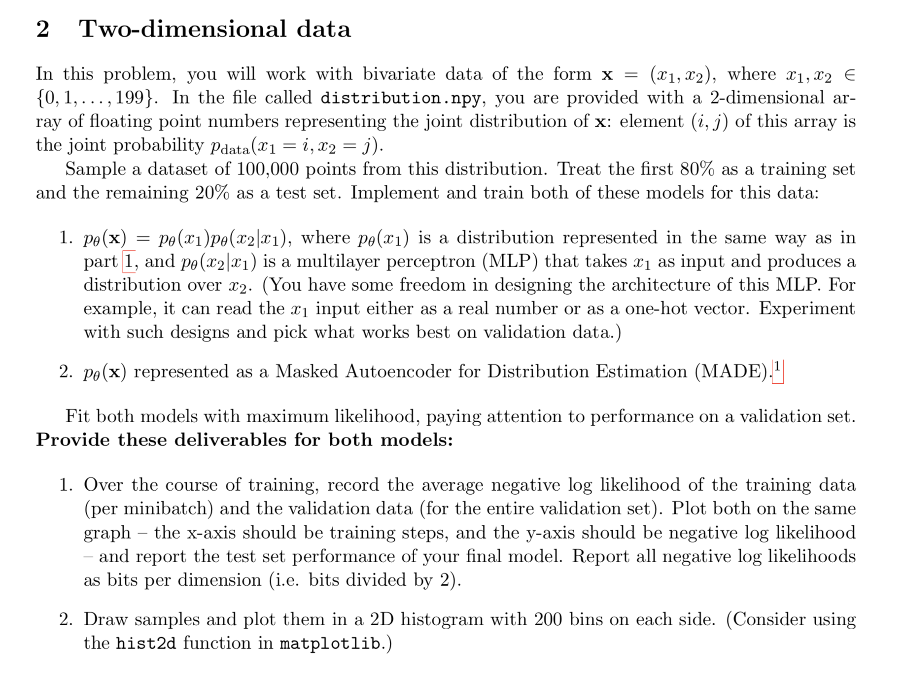
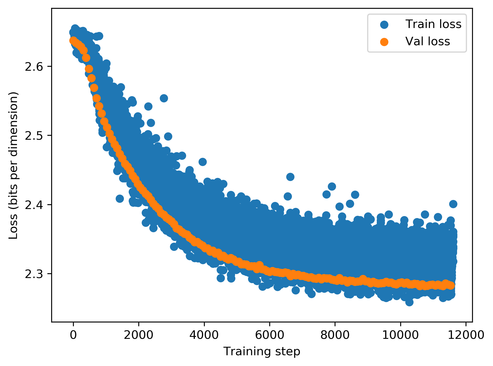
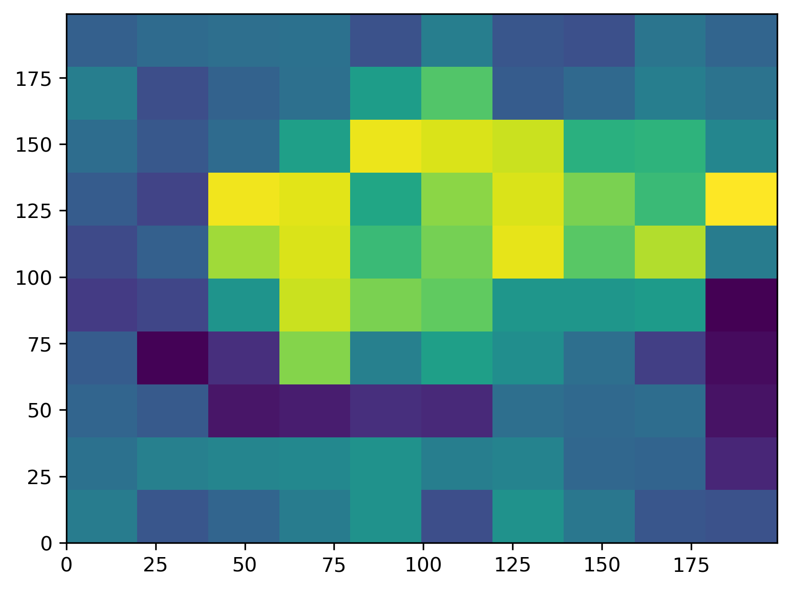
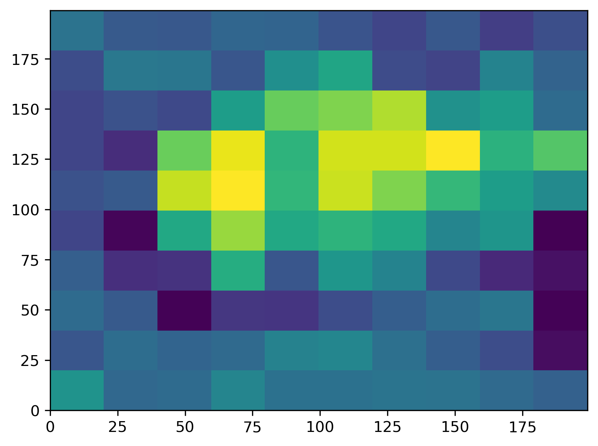
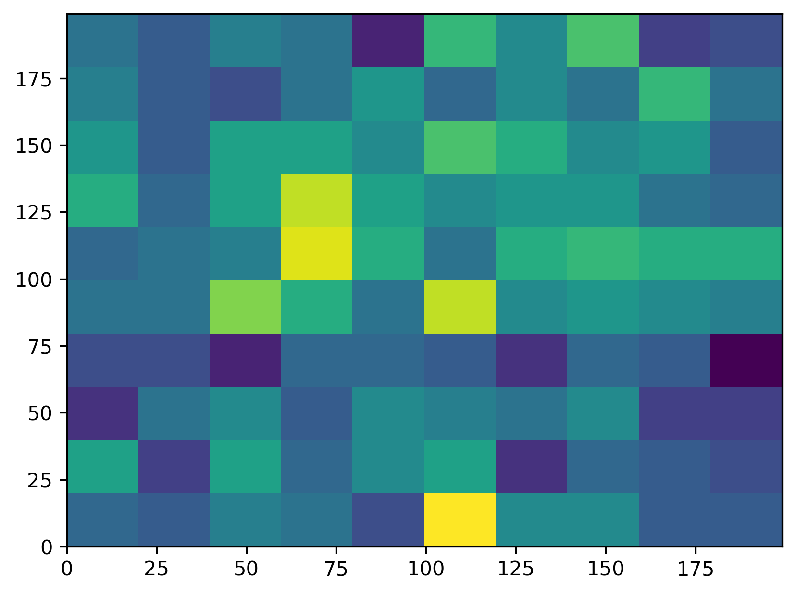
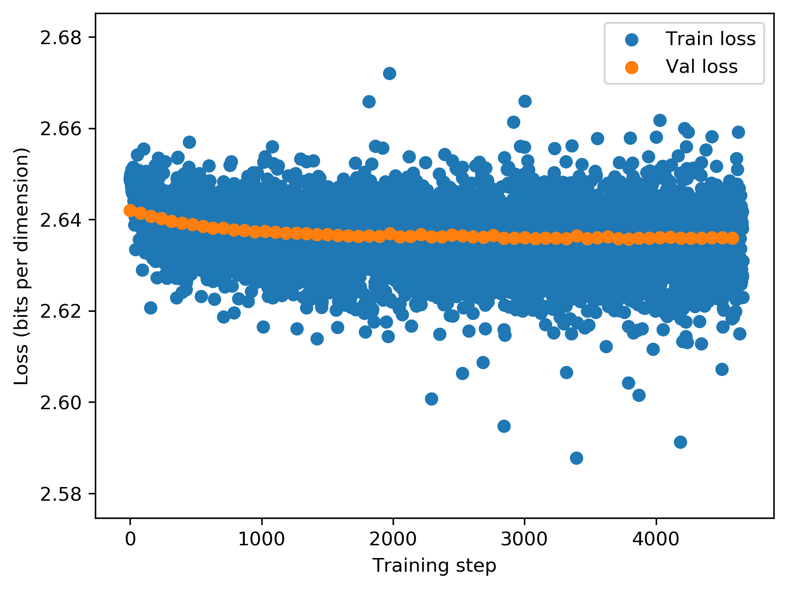
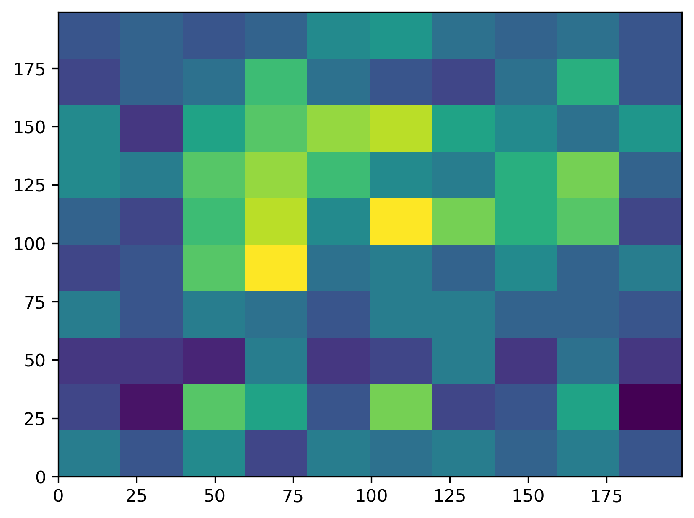

# 2 - Two dimensional data

For model 1:

1. The training curve:

2. The sampled distribution. On the left, the original data distribution. In the middle,
the training data distribution. On the right, the sampled data distribution

  
   
  

For model 2:

1. The training curve:

2. The sampled distribution. On the left, the original data distribution. In the middle,
the training data distribution. On the right, the sampled data distribution

  
   
  

